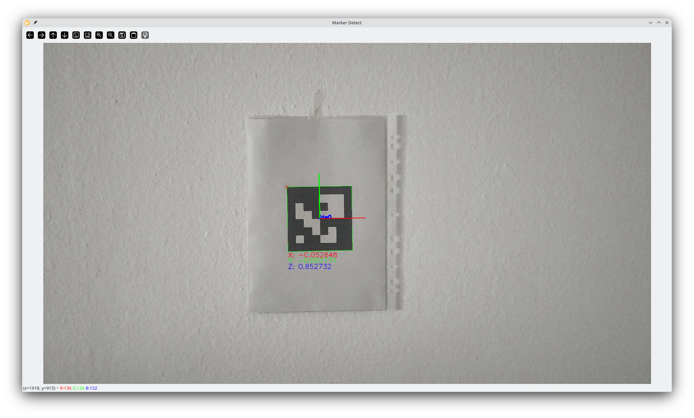

# Description
This program allows you to track an ArUco tag on a video stream and it displays its position relative to the camera. 
You can also calibrate the camera you are using before you start tracking the tag.

# Usage
1. Install the C++ Boost and OpenCV libraries. These are required to build this project.
2. `git clone https://github.com/256shadesofgrey/tag-tracker.git`
3. `cd tag-tracker`
4. `mkdir build`
5. `cd build`
6. `cmake ..`
7. `make -j$(nproc)`
8. Print the checkerboard pattern provided inside `calibration/print`. Alternatively use your own (you will have to adjust parameters in that case). You can also generate a new one with the `tag-tracker-generate-checkerboard` tool that was also built in the previous step. Run it with the `--help` flag to see the options.
9. Print the provided marker. Alternatively use your own or generate a new one with `tag-tracker-generate-tags`. If you use your own, make sure to adjust the parameters of the tag-tracker in the next step. To see your options, use the `--help` flag.
10. Run `tag-tracker` with your camera set as video source and the `--ic` option for interactive calibration. The program was tested with the [IP Webcam android app](https://play.google.com/store/apps/details?id=com.pas.webcam&hl=en_US) that you should be able to find on the play store. If you do the same, run the program as follows, replacing the `<ip>` and `<port>` with whatever the app is showing you when you launch it:  
`
./tag-tracker --ic -s http://<ip>:<port>/video
`  
If you want to save the calibration results to skip the calibration step in the future, you can also add the `-c` option. And if you want to save the images that you take during calibration, add the `-i` option:  
`
./tag-tracker --ic -c -i -s http://<ip>:<port>/video
`
11. If you used the -c option in the previous step, when you run the program again, you can skip the calibration entirely and just get straight to the good part:  
`
./tag-tracker -s http://<ip>:<port>/video
`

# Screenshot

